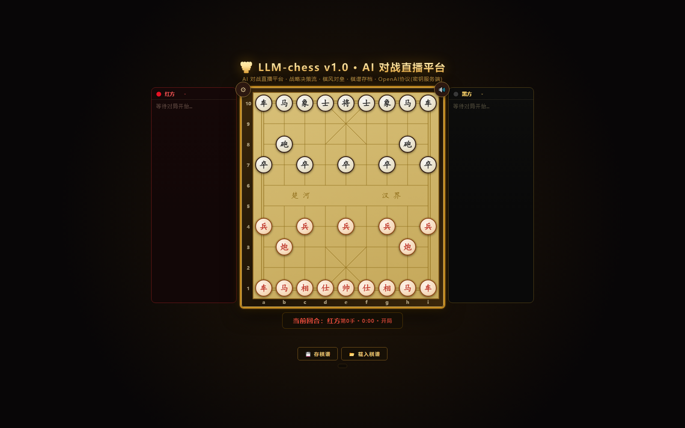

# 🦞 LLM-chess v1.0 · AI Battle & Spectating Platform

[](https://github.com/yydsdbc/LLM-Chess/actions/workflows/ci.yml) [](LICENSE)   



Chinese Chess (Xiangqi) + LLM battle platform. v1.5 decision-card live spectating; v1.6 replay system (re-watch games without calling the LLM); v1.7 HUD dashboard (captured tray / Chinese notation / evaluation sparkline / endgame summary); v2 cyber dark-gold theme. The core engine is standalone-usable for search algorithms (alpha-beta / MCTS) and agent research.

> 📖 [中文文档 (Chinese docs)](README.zh-CN.md) · Detailed per-round dev log: [OPTIMIZATION_LOG.md](OPTIMIZATION_LOG.md)

## Quick Start

```bash
git clone https://github.com/yydsdbc/LLM-Chess.git
cd LLM-Chess
npm start            # or double-click Start.cmd — needs Node.js 18+
```

Your browser opens http://localhost:8788 automatically.

- **Zero-config trial**: gear icon → side selector → pick **Random AI** → play. No API key needed.
- **Plug in an LLM**: edit `config/keys.json`, put your `apiKey` under any provider (a blank template is auto-generated on first run; format reference: `config/keys.example.json`) → restart once. 16 providers supported.
- **One-key tests**: `npm test` (perft gold-standard engine suite + prompt/evaluation/replay/notation guards)
- **Stop**: double-click Stop.cmd or `npm stop`
- **Docker**: `docker build -t llm-chess . && docker run -p 8788:8788 --mount type=bind,src="$PWD/config",dst=/app/config llm-chess` — keys persist in your local `config/`
- **Cloud demo**: a `render.yaml` template is included for one-click deploys on Render.com (add your API keys after the first deploy)

## Security & Configuration

- `config/keys.json` holds your API keys and is excluded via `.gitignore` — it will never be committed. Format reference: `config/keys.example.json`
- Keys live only on the server side; the browser calls the same-origin `/api/chat` relay and never sees them.
- The server listens on 127.0.0.1 by default. For LAN play set the env var `LLMCHESS_HOST=0.0.0.0` and restart.
- Runtime artifacts (logs/ temp/ screenshots/) are not tracked.

## Project Layout

```
LLM-chess/
├── index.html          # page shell (loads scripts only)
├── server.js           # local server: static hosting + /api/chat key relay
├── Start.cmd / Stop.cmd  # one-click background start/stop (port 8788)
├── OPTIMIZATION_LOG.md # per-round optimization log (human + auto agent)
├── config/
│   └── keys.json       # provider API keys (server-side only; auto-generated template on first run)
├── core/               # engine kernel (browser/Node dual-env, zero UI coupling)
│   ├── piece.js        #   piece {color,type,id}
│   ├── move.js         #   move {from,to,piece,captured} + apply/undo/clone
│   ├── board.js        #   board state (clone/applyMove/undoMove/toText)
│   ├── rules.js        #   piece moves / check / flying-general / attack maps
│   ├── generator.js    #   generateLegalMoves / perft
│   ├── judge.js        #   checkmate / stalemate (stalemate loses)
│   └── engine.js       #   Engine facade (the only entry point for the UI)
├── ai/
│   ├── random_agent.js #   uniform random legal moves (baseline opponent)
│   └── llm_agent.js    #   OpenAI-protocol agent (via /api/chat relay, retries + self-validation)
├── benchmark/
│   ├── match.js        #   match manager (any two agents → game record)
│   ├── record.js       #   records: localStorage + JSON import/export
│   ├── elo.js          #   Elo table
│   └── cli.js          #   headless batch games
├── evaluation/
│   ├── xiangqi_knowledge.js # phase detection (opening/mid/end) + dynamic piece values + principles
│   └── position.js          # PositionEvaluator: mobility / king safety / threats / pawn lines → Chinese summary
├── ui/
│   ├── renderer.js     #   pure renderer (reads engine snapshots only)
│   └── app.js          #   controller: interaction / sound / saves / agent scheduling / replay overlay
├── replay/
│   ├── replay.js            # replay data layer: record → engine state machine (tolerant of dirty data)
│   └── replay_controller.js # replay control: play/pause/step/seek/7 speeds/loop
└── test/               # 7 suites, see Testing below (perft gold standard included)
```

## Features

### Live Spectating (v1.5)
- **Decision cards**: after each move the panel streams cards — move / plan / summary / candidate moves with scores / confidence / time, last 4 kept.
- **Styles**: each side can pick Aggressive / Balanced / Defensive, injected into the system prompt and archived with the game record.
- **Effects**: sliding moves (0.28s), captured-piece ghost fade, check warning sound, red king-square pulse, breathing think-panel border.
- **Unified output protocol**: extended JSON `{from,to,plan,summary,candidates[{move,score}],evaluation,confidence}`; strict retries with field validation (first 2 attempts), coordinate fallback against the legal list (3rd attempt); nested JSON via brace-pairing scanner.

### Replay System (v1.6)
Re-drive saved games on the board **without calling the LLM** (localStorage records / imported JSON / `logs/match_headless.json`). 7 speeds (0.25x–20x), ±5/±10 jumps, keyboard shortcuts, progress resume, wheel stepping, evaluation bar, evaluation sparkline, per-move think-time bar chart, move list with filtering, next-move preview, board coordinates, PGN export.

### HUD Dashboard & Cyber Theme (v1.7 / v2)
Captured tray, latest-move badge (4s fade), Chinese notation (炮八平五 / 砲8平5), evaluation sparkline (±3, own perspective), 60s think reminder, check banner + board pulse, endgame summary card, collapsible think panels. Obsidian × dark-gold full reskin.

### Rule Closures (Asian rules, engine-level)
- **Perpetual check loses**: 6 consecutive checks without changing the move → `result='perpetual'`, checker loses (`ruleEnforce:false` to disable for analysis/replay).
- **Threefold repetition draws**: same position + side to move appearing a 3rd time → `result='repetition'`.
- **Natural-rule draw**: 120 half-moves (60 rounds) without captures → `result='natural'` (configurable `naturalCap`, check moves don't count).
- The model is kept aware: user messages warn at repetition ×2 and check-streak ≥3.

### LLM Quality Guards (code-level)
- **Opening protection**: cannon-taking-knight/advisor/bishop in the first 2 rounds is rejected unless it gives check.
- **Hanging-piece guard**: non-capture rook/cannon/knight moves into an attacked, undefended square (static exchange ≥3 points lost) are rejected and re-asked.
- **Fallback safety valve**: 3rd-attempt coordinate fallback scores worse than the greedy best by >1.5 → replaced by the safe greedy move.
- **Retry cooling**: temperature converges to 0.1 from attempt 2; linear backoff 3s→6s→9s for 429/50x/gateway errors; permanent errors (401/balance/model-not-found) fail fast.
- **Self-validation**: strict JSON field checks, nested-JSON scanner, full-width character rescue, bare-key tolerance, reasoning_content JSON salvage, per-move attempt counting, external abort support.

### Prefix Caching (v2.6/v2.7)
Constant system prompt + append-only (user, assistant) history pairs → every retry/next request reuses the cached prefix. Real-match measurement: 62–84% cache hit; `HIST_CAP` trims long games predictably.

### Prompt System (fast-play oriented)
System prompt ≤2400 chars, 100% Chinese, no fancy symbols (models echo garbage), opening three-task checklist (cannon/central pawns/pawn-opening, then rooks), direction hints, anti-draw rules, move self-checks, trade arithmetic (rook-for-knight loses), river-crossed pawn value, pin-the-cannon discipline, confidence calibration table. The legal-move list is annotated inline: `[b3>e3吃卒杀]` = captures pawn, checkmate; `亏` = losing trade; `危` = hanging after the move.

### Evaluation Knowledge
Phase-aware dynamic piece values (opening rook 990 vs endgame horse 500, crossed pawn 195–234, aged pawn ×0.7), plus named warnings both ways: bare-cannon check, palace-centered horse, pinned central pawn, gate/rib-line control, pawn-in-palace, bottom-rank cannon, incomplete advisors — zero noise at the opening position.

## Providers (16, just fill an apiKey)

| Provider | Protocol | Example models |
|---|---|---|
| TokenRhythm | OpenAI-compatible | glm-5.3-flash / deepseek-v4-flash |
| Alibaba Qwen | OpenAI-compatible (DashScope) | qwen-max / qwen3-max / qwen3.5-plus |
| ByteDance Doubao | OpenAI-compatible (Volcano) | doubao-1.5-pro-32k |
| Tencent Hunyuan | OpenAI-compatible | hunyuan-turbo / hunyuan-pro |
| iFlytek Spark | OpenAI-compatible | 4.0Ultra / max-32k |
| Moonshot Kimi | OpenAI-compatible | kimi-k2-turbo-preview / kimi-k2.6 |
| DeepSeek | OpenAI-compatible | deepseek-chat / deepseek-reasoner |
| Zhipu GLM | OpenAI-compatible | glm-4.7-flash / glm-4.5-flash |
| Baichuan | OpenAI-compatible | Baichuan4 |
| 01.AI | OpenAI-compatible | yi-large |
| StepFun | OpenAI-compatible | step-2-16k |
| MiniMax | OpenAI-compatible | MiniMax-M2.7 / MiniMax-M3 |
| SiliconFlow | OpenAI-compatible | DeepSeek-V3 / Qwen2.5-72B |
| OpenAI | OpenAI-compatible | gpt-4o-mini |
| **Anthropic Claude** | **native protocol (auto-converted by the relay)** | claude-sonnet-4-5 / claude-opus-4-1 |
| **Custom** | any OpenAI-compatible gateway | leave models empty → free-text input |

> Claude goes through the native Anthropic protocol — the relay converts system extraction, alternating messages, x-api-key auth, usage mapping and SSE synthesis automatically. Edit the `custom` block in keys.json for any OpenAI-compatible gateway. Keys hot-reload per request, no restart needed.

## Running Modes

| Mode | How | Notes |
|------|-----|-------|
| Quick start/stop | double-click `Start.cmd` / `Stop.cmd` | = `node server.js` in background (port 8788) |
| Offline (human vs random) | open `index.html` directly | zero dependencies, no server |
| LLM battle | `node server.js` → http://localhost:8788 | fill `config/keys.json` first |

- Settings: ⚙ at the top-left of the board. Each side independently: Human / Random AI / LLM (red and black may use different providers), plus playing style per side.
- Fullscreen spectating: ⛶ button or `F`.
- Arena layout: red think-stream on the left, black on the right (streaming reasoning + cumulative time/moves); bottom banner with side colors and per-move timing. Narrow screens switch to red-top/black-bottom.
- Saves: 💾 export game JSON; 📂 import and replay.
- Batch games: `node benchmark/cli.js 10 200`

## Testing

| Command | Coverage |
|---------|----------|
| `npm test` | runs the full suite below |
| `node test/run_tests.js` | engine, 49 checks (perft gold standard, repetition, perpetual-check tracking, moveTag, threefold draw, hanging guard, natural-rule draw) |
| `node test/test_evaluation.js` | evaluation knowledge, 88 checks (phases / dynamic values / advisors / aged pawns / bare cannon / palace horse / central pawn / gate control / pawn-in-palace / bottom cannon / side+corner horse) |
| `node test/test_llm_convo.js` | LLM agent, 149 checks (prompts / retries / fallback valve / opening guard / warnings / full-width rescue / confidence / attempts / external abort) |
| `node test/replay_smoke.js` | replay, 53 checks (data/control layers, speeds, seek, tolerance, parseEval direction, imported records, capture-jump) |
| `node test/_clean_reason_check.js` | reasoning-stream cleaner, 10 checks |
| `node test/cn_notation_check.js` | Chinese notation, 25 checks (classic anchors / file-disambiguation 前中后 / legacy-key sentinel) |
| `node test/check_ui.js` | syntax (17 files) + ID cross-check + script-src existence + localStorage prefix guard + release files |
| `node test/analyze_blunders.js <log.json>` | blunder detector (hanging moves, missed mates, shuffling; `--top=N --type=...`) |
| `node test/match_headless.js <provider> <model> [n]` | headless LLM game, n moves |

## Evaluation Data Flow

Board → Rules → PositionEvaluator → XiangqiKnowledge → short Chinese summary → LLM picks the move.

- The LLM handles strategy / candidate choice / style; the engine handles rules, numeric evaluation and analysis.
- Piece values adapt to phase (opening rook 990, opening knight 360 → endgame knight 500, cannon 383, crossed pawn up to 234).
- Only a short Chinese summary (phase / score / advantages / risks / capturable pieces / legal count) is injected into the prompt.

## Engine API

```js
var e = XQ.Engine.create();
e.applyPlayerMove(fx, fy, tx, ty)   // the only write entry, validates legality
e.generateLegalMoves(color)
e.legalTargets(x,y) / dangerTargets(x,y)
e.undoPly() / newGame() / serialize() / loadSerialized()
e.boardText() / legalMoveStrings(color)   // prompt helpers
e.repetitionCount()                  // repetition count; 3rd occurrence auto-draws (v2.2)
e.checkStreak(color)                 // consecutive checks; 6 = perpetual loss (v2.0)
e.naturalClock()                     // capture-free half-move clock; 120 = natural draw (v3.8)

// search algorithms can use the low-level pieces directly:
var b = e.cloneBoard();                       // cheap copy
XQ.Generator.perft(b, 'red', depth);          // verified 44/1920/79666
b.applyMove(m); b.undoMove(m);                // reversible simulation
XQ.Judge.status(b, colorToMove);
XQ.Judge.moveTag(b, opColor[, movesPre]);     // one-move effect: mate/stalemate/check/null
```

Move object: `{ from:{x,y}, to:{x,y}, piece:{color,type,id}, captured }`

## Correctness

`node test/run_tests.js` — 49 assertions green, including the publicly recognized perft numbers:
**perft(1)=44 · perft(2)=1920 · perft(3)=79666**, plus zero illegal moves across thousands of random plies and edge cases (checkmate, stalemate, flying general).

## Troubleshooting

- **401 / "未配置 apiKey"**: fill `apiKey` under your provider in `config/keys.json` (hot-reloaded per request). Missing models / insufficient balance fail fast without burning retries.
- **REASONING_REQUIRED / UNKNOWN_FIELD**: GLM-family upstreams force thinking — the agent strips the `thinking` field and retries automatically.
- **503/504, one move taking 70–300s**: provider queue waves; the agent uses a 120s timeout + retries + backoff. tokenrhythm occasionally has DNS hiccups — just retry.
- **Hot reload scope**: changes under ai/ ui/ replay/ and index.html apply on browser refresh; keys.json hot-reloads; **only server.js changes need a restart** (Stop.cmd → Start.cmd).
- **Headless game ends with MATCH INCOMPLETE**: expected exit code when moves < limit or meta rate < 100% (fallback moves carry no meta) — not a crash. Check logs/blunders_*.txt.
- **Move spinner keeps spinning**: open browser console and server.log, look for `[LLM 红/黑] attempt N failed` lines.

## Security Model

API keys exist only in server-side `config/keys.json` (never commit it — it is git-ignored). The frontend calls the same-origin `/api/chat` relay with `{provider, model, messages}` only; keys never leave the server. Token usage recorded via the relayed `usage` field into the game record.

## v3.9.2 (latest round, 2026-08-31)

- **Analyze-blunders: 长将检测** — analyze_blunders 检测器新增 `长将` issue 类型 (连续将军 ≥4 手警告 / =6 长将判负); 此前 analyzer 走 ruleEnforce:false 不重判规则, 旧棋谱的连将拉锯默认不报, 现与 E12 引擎守门同源统计。
- **Replay: 跳到下一手吃子 / 上一手吃子 (键盘 `C` / `Shift+C`, 按钮 `⏪吃` / `吃子⏩`)** — 长局 (几十手) 跳过拉扯段快速看子力交换点; controller 新增 `stepNextCapture` / `stepPrevCapture` (边界: 末尾/起点; 零吃子平跳); 走法表/帮助模态同步。
- **Evaluation: 槽心马/挂角马知识 (v3.9.2)** — 检测己方马已逼近对方九宫侧翼位 (x∈{1,2,6,7} + 对方宫城行 ±1), 双向点名 (攻方「可跴将抽车取势, 护住马眼勿轻兑」/ 守方「勿随手送马, 可驱赶/走跴」); 与窝心马 v2.5 (x=4 宫心) 互斥; 初始局零噪音。
- **PGN 导出加中文记谱 (v3.9.2)** — rpExportPGN 每手 comment 追加 `{cn: 炮八平五}` (与原 summary 并列), 中文用户直接看走子, 国际 PGN 解析器忽略额外字段。
- 5 项总计; test 149 / 88 / 49 / 53 / 10 / 25 / check_ui EXIT 0; 完整清单见 [OPTIMIZATION_LOG.md](OPTIMIZATION_LOG.md) 11 轮。

## License

[MIT](LICENSE)
